# Architecture

This document explains how the platform works and why it is built this way.
The [README](README.md) explains how to run and use it. Read this if you plan
to change the platform or adapt it to another RCP product.

**Contents:**
[1. Components](#1-components) ·
[2. Life of a regression](#2-life-of-a-regression) ·
[3. State machines](#3-state-machines) ·
[4. Scheduling](#4-scheduling) ·
[5. What Nomad does here](#5-what-nomad-does-here) ·
[6. The catalog](#6-the-catalog) ·
[7. Nodes](#7-nodes) ·
[8. Execution on the node](#8-execution-on-the-node) ·
[9. Results](#9-results) ·
[10. Failure handling](#10-failure-handling) ·
[11. API surface](#11-api-surface) ·
[12. Adapting it to your product](#12-adapting-it-to-your-product) ·
[Design notes](#design-notes) ·
[What this PoC does not do yet](#what-this-poc-does-not-do-yet)

## 1. Components

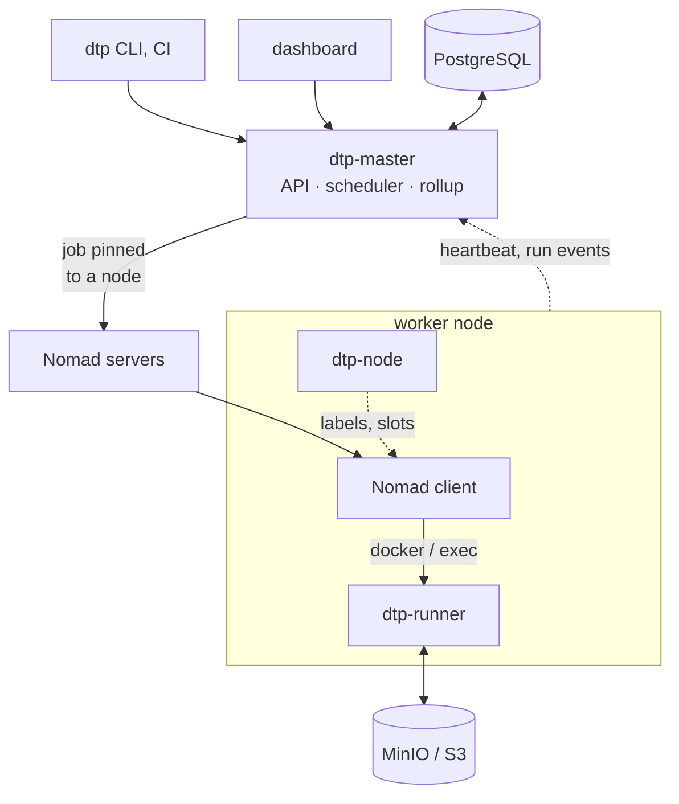

| Component | Runs on | Responsible for |
|---|---|---|
| **`dtp-master`** (Go, one process) | one machine, or as a Nomad service job | the queue, the slot ledger, quota rules, node choice, Nomad job generation, reconciliation, retries, JUnit rollup, the catalog, the REST API and the dashboard |
| **PostgreSQL** | next to the master | regressions, runs (the queue is `runs WHERE state = 'queued'`), the catalog tables. The local demo uses JSON files instead. |
| **Nomad servers** | cluster | node inventory, allocation lifecycle. They do not choose nodes; the master does. |
| **Nomad client** | every worker | reports the node's cores and memory, runs one task per suite attempt with the `docker` or `exec` / `raw_exec` driver, enforces the task's cores and memory. It knows nothing about pools. |
| **`dtp-node`** | every worker, as a service | publishes the node's labels, slot count and slot size, sends heartbeats, installs `dtp-runner`, prunes the build cache |
| **`dtp-runner`** | every worker, one per suite attempt (the Nomad task) | fetches the build into the cache, runs the harness, uploads artifacts, reports results |
| **`run-suite.sh`** | inside the task | the harness: `tycho`, `eclipse` or `fixture` |
| **MinIO / S3** | cluster | artifacts under `results/<regression>/<suite>/attempt-N/`, build payloads under `builds/` |
| **`dtp`** (CLI) | operator or CI | submit, follow, cancel, inspect pools, nodes, quotas and the catalog, discover suites |

Two JSON documents connect the master and the node:

* **RunSpec** (master to node) contains everything one attempt needs: build
  payloads, command, environment, timeout, slot size, cache directory, the
  object-store target and prefix, the master URL and a token for this run.
  It travels base64-encoded in the task environment (`DTP_RUN_SPEC`). The
  runner needs no configuration file and no cluster lookups.
* **RunEvent** (node to master) is posted to `/api/v1/runs/{id}/events`
  with the run's token. There are three kinds: `started` (node identity),
  `progress` (interim JUnit counts, every 15 seconds), and `finished` (state,
  exit code, summary, failing cases, artifact list).

The master contains no test logic. The runner contains no scheduling logic.

## 2. Life of a regression

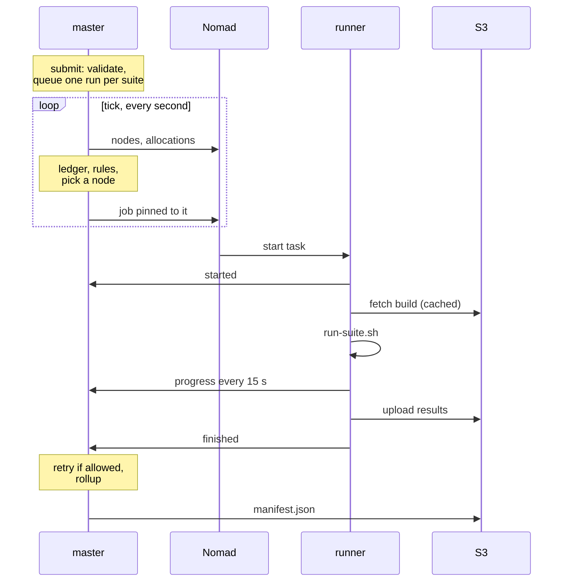

The scheduler tick runs once a second and has four steps:

1. **Refresh inventory.** Ask Nomad for the nodes: ready or not, and their
   `meta.dtp.*` labels, slot count and slot size (cached for 5 seconds).
2. **Reconcile.** Compare every dispatched or running run with Nomad's
   allocations: notice tasks that started, finished without a callback, were
   lost, or overran their timeout.
3. **Admit.** For queued runs, in priority order: check the quota rules,
   choose a node, build the RunSpec, register the job.
4. **Rollup.** Recompute each regression's totals and state. Write
   `manifest.json` when a regression completes.

A suite is the unit of work everywhere: one run, one slot, one node, one
artifact prefix per attempt. There is no test-level sharding. An OSGi runtime
takes 15 to 45 seconds to boot, so anything smaller than a suite would spend
most of its time booting.

## 3. State machines

### A run (one attempt of one suite)

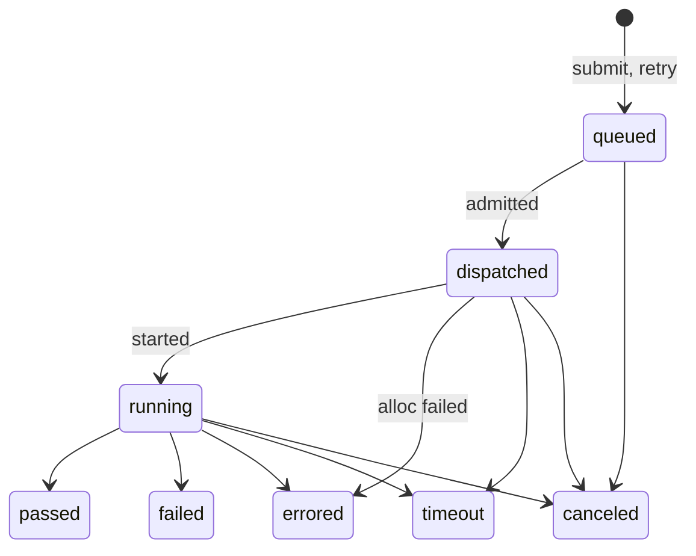

| Transition | When |
|---|---|
| queued → dispatched | a slot is free, no quota rule is at its limit, a node was chosen and the job registered |
| dispatched → running | the runner posts `started` (or Nomad shows the task running) |
| dispatched → errored | the allocation failed or was lost, or the job is gone |
| dispatched / running → timeout | the deadline passed: the runner kills the process, or the master stops the task 5 minutes later |
| running → passed / failed | the runner posts `finished`: no test failures, or some |
| running → errored | `finished` with no results and a non-zero exit, OOM kill, or a lost allocation |
| any → canceled | `dtp cancel` or the dashboard |

* `failed`, `errored` and `timeout` are retryable. If the suite still has
  attempts left (`retries`), a **new** run is queued with `attempt + 1`, its
  own token and its own artifact prefix. The old run keeps its state.
* `canceled` is never retried.
* When the master restarts, runs that were `dispatched` or `running` go back
  to `queued` and are admitted again. The job id is deterministic
  (`dtp-<regression>-<suite>-<attempt>`), so re-dispatching registers the
  same job again. If the job is unchanged (same node), Nomad keeps the
  allocation that is already running. If the master chose another node this
  time, Nomad replaces the allocation and the attempt starts over there.

### A regression

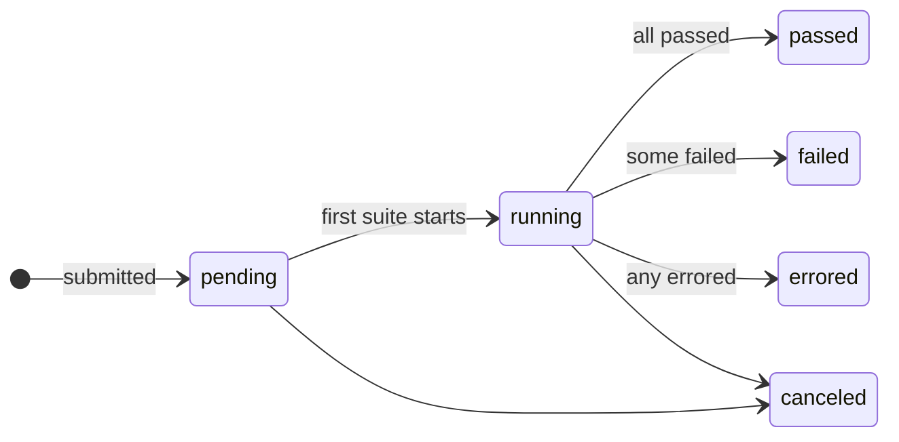

A suite's verdict is its newest attempt. A suite that passes only on a retry
is counted as **flaky** in the totals. Canceling a single suite counts it as
errored in the regression's totals; canceling the regression sets the
regression to `canceled`.

### A node, as the master sees it

Three independent things describe a node: whether Nomad reports it ready,
which pool the catalog assigns it to, and whether its agent is reporting.

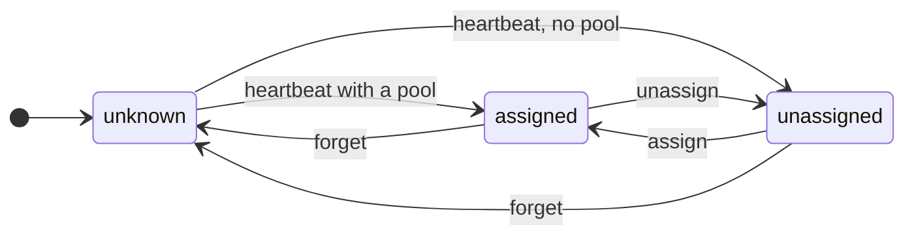

A node gets new work only when it is **assigned** and Nomad reports it
**ready**. Work that is already running on a node is not affected by any of
these transitions. It finishes where it is and stays charged to that node.

The agent has its own health: **no agent** (never reported), **reporting**,
or **silent** (no heartbeat for 3 minutes). Scheduling does not depend on the
agent. It uses the labels Nomad holds, which the agent last wrote.

### A runner (one attempt, on the node)

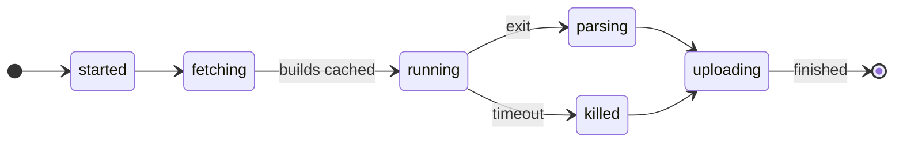

While `running`, the runner posts `progress` every 15 seconds with the counts
it can parse so far. A timeout kills the process group; what was uploaded and
parsed by then still reaches the master.

### The agent (dtp-node)

Every tick (the `interval` in `node.yaml`, 60 seconds by default):

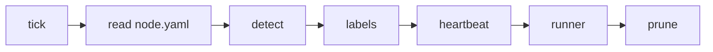

Labels are written into the Nomad client only when they changed. The runner
is downloaded only when the master's checksum differs from the installed
copy. The cache is pruned once an hour.

## 4. Scheduling

### Slots

A slot is the set of resources one suite gets: `cores` (dedicated cores, a
cpuset; the same amount on a fast or a slow machine), `memory` (reserved, and
the hard limit under Docker), `memory_max` (a burst limit above the
reservation, using Nomad memory oversubscription) and `disk`.

Both the number of slots and the size of a slot are declared by the node, in
its `node.yaml` (`slots:` and `slot:`). The agent publishes them as
`meta.dtp.slots` and `meta.dtp.slot.*`. Every task placed on a node requests
exactly one of that node's slots. Nothing is inferred from the hardware. The
agent only warns when the declared numbers do not fit the machine.

### The ledger

Every tick, the scheduler builds a ledger: every node Nomad reports, the pool
the catalog assigns it to (no pool means no capacity), its declared slots,
and the runs currently charged to it. A pool's capacity is the sum over its
ready, assigned nodes; a virtual pool's capacity is the sum over its members'
nodes.

The ledger is admission control. The master never hands Nomad more work than
the nodes can run, so the queue stays in the master, where it can be
prioritized, inspected and canceled.

### Pools

A pool is a row in the catalog. It says how suites run there (runtime,
driver, image, command, cache directory) and which nodes serve it
(`nodes.pool_name`). Nomad does not know about pools; every client stays in
Nomad's default node pool.

A virtual pool spans concrete pools. Its nodes are their nodes. It inherits
runtime, driver and the other settings from its first member, and all
members must share one runtime and driver, because a job runs under one
driver.

### Admission and node choice

Queued runs are considered in priority order (0 to 100, higher first). Within
one priority, the next slot goes to the eligible run whose user currently
holds the fewest slots, oldest first. This is fair share: a 50-suite nightly
and a 5-suite check interleave instead of the nightly blocking everything. A
run that cannot start is skipped. It does not block the runs behind it.

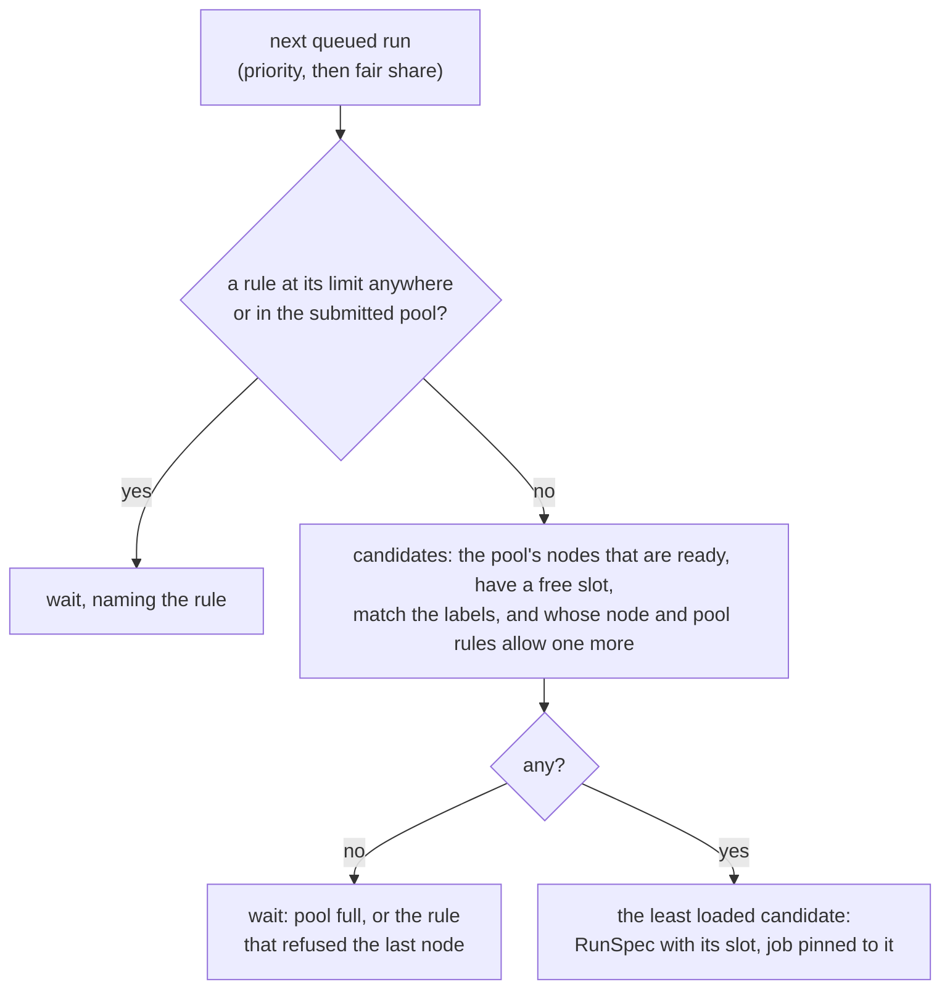

The chosen node's id and name are recorded on the run. The suite's `requires`
and the pool's `constraints` are also written on the Nomad job as
`${meta.dtp.*}` constraints, but they can only match the pinned node; they
document why the node qualified.

Moving a node to another pool takes effect on the next tick. What the node
is running keeps running.

### Quota rules

A quota rule is one row: a **subject** (one user, one group, or everyone), a
**scope** (one node, one pool, or everywhere) and a limit on concurrent
slots. A group or everyone rule limits each user separately, unless it says
`together`, in which case it limits all of them added up.

How the per-user cap for one user in one scope is found:

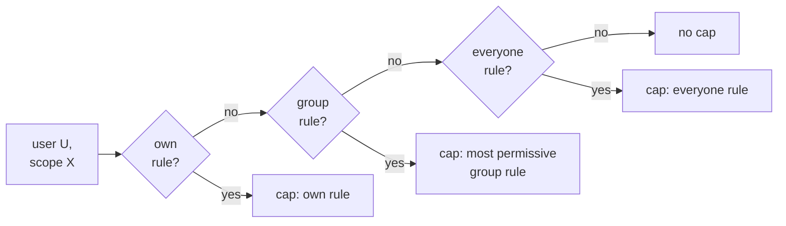

Every `together` rule for the scope that covers the user applies as well:
the user's groups' together rules and the everyone-together rule. The run
may start only if the user's runs in the scope are below the cap and every
together rule is below its limit.

The scopes checked for one placement are: everywhere, the submitted pool,
the concrete pool of the candidate node, every virtual pool that spans that
concrete pool, and the node itself. A rule scoped to a pool therefore sees
work that lands in the pool however it got there. For example, a run
submitted to the virtual `global` pool that lands on a `high-perf-pool` node
counts in both pools.

Rules for different scopes are all enforced. A limit of 0 forbids. No rule
means no limit. Groups carry no limits themselves; they are only sets of
users that rules can name.

### Retries and timeouts

`retries: N` per suite (or `default_retries`) allows N more attempts after a
`failed`, `errored` or `timeout` result. Each attempt is a new run with its
own token and artifact prefix.

The timeout (`timeout` per suite, else `default_timeout`) is enforced twice.
The runner kills the process group at the deadline and reports `timeout`. If
the runner itself is stuck, the master stops the allocation 5 minutes after
the deadline.

## 5. What Nomad does here

Nomad is used as an execution engine for the fleet, not as a scheduler. The
master picks the node, because a run must be charged to one node's slot,
nodes belong to pools by a catalog row, and quota rules can be scoped to a
node. The job is then pinned to that node.

| Nomad still does | Nomad no longer does |
|---|---|
| **Runs the task with isolation and limits.** The `docker` / `exec` / `raw_exec` drivers give each attempt a cgroup and a task directory, a cpuset for `cores`, the memory reservation as the limit and `memory_max` as the burst limit, ephemeral disk, log capture, and a kill on stop. | **Choose the node.** Every job carries a `${node.unique.id} = <chosen node>` constraint. With one feasible node there is nothing left for Nomad's scheduler to decide. |
| **Acts as the agent on every node**, with one API for the master and `dtp-node`: node fingerprinting (reservable cores, memory), liveness (a node goes `down` when its heartbeat lapses), dynamic node metadata (`meta.dtp.*` is stored and served by the client), and start, stop and inspect of a process on any machine without SSH. | **Match labels.** The `${meta.dtp.*}` constraints are still written on the job, but the master already checked them when it chose the node. |
| **Keeps allocations alive across a master restart** and reports how they ended: exit code, OOM detail, lost node. Deterministic job ids let the master find them again. | **Know about pools.** Every client sits in Nomad's default node pool. The pools are rows in the master's catalog; moving a node between them is an UPDATE. |
| **Refuses what does not fit.** If a node declares more slots than it has cores or memory for, the pinned job's evaluation stays blocked and the run reports "waiting for placement" after 10 minutes. This is the one placement decision Nomad still makes: a safety net under the operator's `slots:` number. | **Retry or reschedule.** Both are disabled on every job. A retry is a new attempt with its own artifacts, decided by the master. |
| Fetches the runner for process pools (`artifact` stanza), mounts host volumes, shows allocations and their logs in its UI. | |

The job the master registers, one per attempt:

* id `dtp-<regression>-<suite>-<attempt>` (deterministic), type `batch`,
  priority mapped from the submission, `NodePool` `all`;
* the node pin plus the meta constraints described above;
* one task group with `Count: 1`; restarts and rescheduling disabled;
* resources = one of the node's slots; ephemeral disk = the slot's disk;
* `Meta` with the regression, suite and run ids, for the Nomad UI;
* container pools: the `docker` driver, the worker image, `network_mode`
  when the client itself is a container, the build cache bind-mounted (or a
  host volume), entrypoint `dtp-runner`;
* process pools: the `exec` (or `raw_exec`) driver launching `dtp-runner`
  from the node (installed by the agent, or fetched through the `artifact`
  stanza from `runner_url`).

The master reads all allocations in one request per tick and maps them to
runs by job id. A run whose job vanished becomes `errored` ("job not found").
An OOM-killed task is reported as such, from the driver's `oom_killed`
detail.

**Could Nomad be removed?** Yes. The local backend already shows the shape:
the master runs suites as child processes against simulated nodes. Without
Nomad, `dtp-node` would have to become the executor: launch a container or a
process in a cgroup with a cpuset and a memory limit, enforce the timeout,
capture logs, report the exit, and stay reachable from the master. The master
would need its own node RPC and liveness tracking. That is a few hundred
lines of the process-supervision code Nomad already has, in exchange for one
fewer cluster to run. It is worth doing only if operating Nomad costs more
than writing that. Everything Nomad-specific sits behind the
`backend.Backend` interface, so the option stays open.

## 6. The catalog

Pools, node assignments, groups, users and quota rules describe the lab, not
the master process. They live only in the store:

* **PostgreSQL:** `pools` (one column per field) and `pool_members` (the
  members of a virtual pool), `nodes` (name to pool), `groups`, `users`,
  `group_members` (one row per membership) and `quota_rules` (one row per
  rule). A fresh database gets the schema and, in the demo, the lab from
  `deploy/sql/*.sql` at first init.
* **File store:** `catalog.json` in the state directory. `make demo` applies
  `deploy/local.catalog.json` on first start.

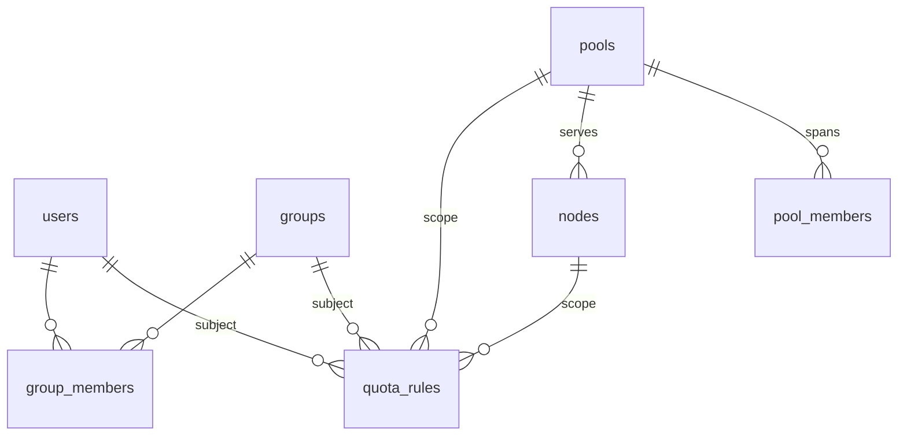

The `regressions` and `runs` tables sit next to these. A run references its
regression.

How changes reach the master:

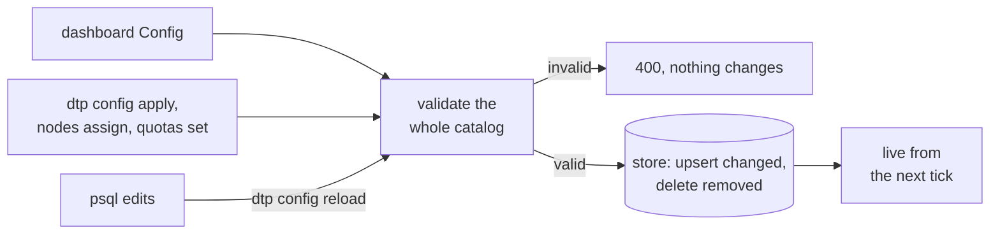

Rules of the catalog:

* The master reads the store at startup and on reload. It writes through the
  config API only. Writes are upserts that skip unchanged rows, plus deletes
  of rows the new catalog no longer has. `created_at` survives a save and
  `updated_at` moves only for rows that changed.
* Every write is idempotent. Applying a catalog equal to the live one changes
  nothing. Deleting something that is not there is a no-op.
* Every change is validated as a whole catalog: unknown members of a virtual
  pool, mixed runtimes in a virtual pool, a node assigned to an unknown or
  virtual pool, a rule naming an unknown user, group, pool or node. A
  rejected change leaves the previous catalog in force. The reason comes back
  in the API response, or appears as `store_error` on `GET /api/v1/config`
  when the store itself held a bad catalog.
* The scheduler takes one immutable snapshot per tick, so a change never
  lands in the middle of admission.
* The store holds the catalog as written. Defaults and virtual-pool
  inheritance are computed when it is loaded.
* The only thing the master writes on its own is a `nodes` row for an agent
  it has never seen: in the pool its `node.yaml` suggests if that pool
  exists, otherwise unassigned.
* Removing a pool, node, group or user also removes the rules that name it
  (and a group's memberships). Nothing dangles.

## 7. Nodes

A worker is a Nomad client plus the agent.

* The **Nomad client HCL** holds only what cannot change at runtime: data
  directory, servers, drivers, and `reservable_cores` / `memory_total_mb`
  when a machine is shared. There is no `node_pool`. `dtp-node nomad-config`
  renders this file from `node.yaml`.
* **`dtp-node`** (with `node.yaml` next to it) detects the machine, merges
  the configured labels, publishes the declared `slots` and `slot` (and warns
  when `slots × slot` does not fit the machine), and writes `meta.dtp.*` into
  the running client through Nomad's dynamic node metadata API. It tracks
  which keys it owns, so a label removed from `node.yaml` is removed from the
  node. It sends heartbeats to the master, installs `dtp-runner` into
  `runner_dir` when the master's copy changes, and deletes cache entries
  unused for `cache_keep`.
* The **assignment** is the master's: `nodes.pool_name`, edited in Config,
  with `dtp nodes assign`, or in SQL. A node in no pool is listed as
  unassigned and gets no new work.

How a node's slot count is decided. It is declared, never inferred:

1. The operator writes `slots: N` and the `slot:` block in `node.yaml`.
   `dtp-node` publishes them as `meta.dtp.slots` and `meta.dtp.slot.*`, and
   warns when `N × slot` exceeds what Nomad reports for the node
   ([`agent.CheckCapacity`](internal/agent/agent.go)). It never changes the
   numbers.
2. The master takes them as they are. A node that declares nothing has no
   slots, and is shown that way. The ledger counts ready, assigned nodes per
   pool and admits work only into free slots.
3. Nomad enforces the physical side. Every task reserves one slot's cores
   and memory on the pinned node. An over-declared node simply cannot place
   its extra slots, and the agent will have warned about it.

Nothing in the master depends on the agent. A node labelled by hand in HCL
works too. The dashboard shows agent health per node, and `dtp nodes` shows
each node's pool, status, slots and slot size.

## 8. Execution on the node

`dtp-runner` (one per attempt) does the following, in order:

1. Posts `started`.
2. For each build payload, makes sure it is in the cache
   (`cache.Ensure`): download by URL or `s3://`, verify the sha256, unpack
   zip or tar into `<cache_dir>/<sha256>/payload`, mark it ready with an
   atomic rename. Concurrent attempts that want the same payload wait on a
   lock file, so a payload is downloaded once per node.
3. Exports `DTP_BUILD_<NAME>` (plus `_VERSION` and `_ID` from the manifest),
   `DTP_SUITE`, `DTP_RESULTS_DIR`, `DTP_WORKSPACE`, `DTP_SLOT_*`, and the
   suite's `env`.
4. Runs the pool's command (`run-suite.sh`) in its own process group, with
   the timeout.
5. Parses every `*.xml` under the results directory as surefire output and
   classifies the result.
6. Uploads the results directory and posts `finished`.

Classification is what makes retries meaningful: parsed test failures mean
`failed` (a test problem); a non-zero exit with no results means `errored` (a
harness problem); a timeout means `timeout`.

`run-suite.sh` picks the harness from `DTP_HARNESS` (or infers it):

| Harness | Needs | Does |
|---|---|---|
| `tycho` | a reactor payload (`src/` + `m2/` + `mvn.args`, from `scripts/build-egit.sh` or your equivalent) | copies the tree into the workspace, starts Xvfb and metacity, runs `mvn -o verify -pl <suite>` against the shared repository, mirrors surefire XML as classes finish, collects the workspace log and every `screenshots/` directory |
| `eclipse` | an RCP product payload named `product` plus `DTP_TEST_APPLICATION` | starts Xvfb and a window manager and launches the Eclipse test framework application with `-testpluginname` / `-classname`; surefire XML comes from the formatter |
| `fixture` | nothing | the simulated suite |

Adding a harness is a `case` branch in that script. The platform only sees
the results directory.

## 9. Results

The node uploads and the master parses. `internal/junit` handles a
`<testsuites>` wrapper or a bare `<testsuite>`, nested suites, and keeps
failing and errored cases (message plus a truncated stack) in the store. The
full text is always in the artifact.

Totals per regression fold the newest attempt of every suite: tests, passed,
failed (including errors), skipped, flaky, and the suite counts. The
regression is `errored` if any suite errored, else `failed` if any failed,
else `passed`. `manifest.json` (the regression, every attempt, every artifact
path) is written to `results/<regression>/` on completion.

Artifacts are served through the master (`/api/v1/runs/{id}/artifacts/…`),
so the browser needs no object-store credentials.

## 10. Failure handling

| What breaks | What happens |
|---|---|
| a test fails | the suite is `failed`; retried if `retries` allows; flaky if the retry passes |
| the harness dies without XML | `errored`; retried the same way |
| the task is OOM-killed | `errored` with "OOM killed … (exit 137)"; raise `memory_mb` or `memory_max_mb` on the node |
| the runner cannot reach the master | it retries the callback with backoff; the master's poll sees the allocation complete and classifies from what it has |
| the allocation is lost (node died) | `errored`, "allocation lost"; retried |
| the master restarts | the store reloads everything; runs in flight are re-queued and re-dispatched under the same job id, so Nomad keeps an allocation that is still running on the same node |
| a node disappears | its slots leave the ledger at the next inventory refresh; work running on it is caught by reconciliation |
| an invalid catalog is stored | rejected, logged once, shown on `/api/v1/config`; the last good one stays live |
| the agent is silent | the node shows "agent silent"; scheduling continues with the labels Nomad has |

## 11. API surface

| Endpoint | Purpose |
|---|---|
| `POST /api/v1/regressions` | submit; `GET` lists; `GET /{id}` returns the detail with per-suite views |
| `POST /api/v1/regressions/{id}/cancel`, `…/suites/{suite}/cancel` | cancel everything, or one suite |
| `GET /api/v1/runs/{id}`, `…/artifacts`, `…/artifacts/{path}` | one attempt, its artifact list, an artifact streamed through the master |
| `POST /api/v1/runs/{id}/events` | the runner callback (bearer token per run) |
| `GET /api/v1/pools`, `/quotas`, `/nodes`, `/builds` | the ledger, the rules with their usage, the nodes and agents, the build repository |
| `GET /api/v1/overview?since=` | everything the dashboard shows; long-polls on the store revision |
| `GET /api/v1/catalog` | choices for the composer: pools, node label values, suites, users, templates, builds |
| `GET/PUT /api/v1/config`, `POST …/config/reload`, `PUT/DELETE …/pools/{name}`, `…/nodes/{name}`, `…/groups/{name}`, `…/users/{name}`, `…/quotas/{rule-key}` | the catalog: read it, replace it, re-read it from the store, edit one row |
| `POST /api/v1/nodes/{name}/heartbeat`, `GET /api/v1/runner[/sha256]` | the node agent |

There is no authentication. This is an internal system: the `user` field is
trusted, and the runner callbacks are the only token-protected calls.

## 12. Adapting it to your product

The platform is generic. The product-specific parts are configuration,
scripts and payloads, not Go code.

1. **Build payload.** Produce one archive per build with everything a suite
   needs. For Tycho that is the reactor plus the Maven repository it resolved
   against, proven to work offline, plus `mvn.args`. For a product it is the
   unpacked RCP product plus the test bundles. Publish it to `s3://builds/…`
   together with its manifest (`product`, `version`, `sha256`, `unpack`,
   `harness`, `suites`). Submissions then ask for `"id": "latest"` or a
   pinned id. `scripts/build-egit.sh` is the template.
2. **Harness.** If your suites run with Tycho, `DTP_HARNESS: tycho` already
   works (`dtp discover <reactor>` lists the modules). If they run through
   the Eclipse test framework, set `DTP_TEST_APPLICATION` and use `eclipse`.
   Otherwise add a `case` to `run-suite.sh`: start what you need, run, and
   leave surefire XML in `$DTP_RESULTS_DIR`.
3. **Worker image and nodes.** For container pools, put your runtime
   dependencies in `deploy/images/rcp-runner.Dockerfile` (it already has JDK
   21, Maven, Xvfb, metacity, GTK and WebKit). For process pools, provision
   the node, run `dtp-node` with a `node.yaml`, and let it install the runner
   and label the node.
4. **Pools, nodes and slots.** Write your pools as rows (copy
   `deploy/sql/010_seed_catalog.sql`): names, runtime, image, command. Assign
   each node to a pool, or let the agents register with a `pool:` suggestion
   and adjust in Config. Size the slot in each node's `node.yaml` for your
   heaviest suite (`memory_max_mb` for JVM bursts) and choose `slots` so that
   `slots × slot` fits the machine. The agent warns if it does not. There is
   nothing to create in Nomad.
5. **Quotas.** One group per team, users listed once. Then rules: an
   everyone-anywhere rule as the default cap, a group rule where a team gets
   more, `together` rules where a team or a pool must not be swamped, user
   rules for exceptions (a CI identity that may run more, a contractor kept
   off a pool with a 0), and a node rule where a machine must keep a slot
   free.
6. **Submissions.** Write one submission file per kind of regression
   (nightly, per branch, smoke) and keep them in `templates_dir` so the
   dashboard offers them. `${VAR}` placeholders take the build id from CI. In
   CI, `dtp submit nightly.json -w -user ci` exits non-zero unless the
   regression passed.

## Design notes

The reasoning behind the less obvious choices.

### Why the master picks the node and Nomad still runs it

"Each node has N slots of this size" is a capacity statement. Nomad only
understands resources. The node's own declaration makes the two agree: every
task placed on a node requests one of that node's slots, and the node offers
`slots ×` that. The ledger decides *when* work is handed to Nomad, so the
queue stays in the master where it can be prioritized, inspected and
canceled. Because the ledger already knows which node has a free slot with
the right labels, it also decides *where*, and pins the job to that node.
Nomad then does what it is good at: running the task with the cores and
memory reserved, restarting nothing, reporting the exit. It knows nothing
about pools. That is what lets a pool be a catalog row: moving a node between
pools is an UPDATE, not a client reconfiguration.

### Why the master parses and the runner uploads

The runner is a short-lived process on a machine that may disappear. The
master is the one place with durable state. So the runner does only what
must happen on the node (fetch, run, upload) and reports what it found in
the XML. The master's own parse of the same XML is what the rollup trusts.
Progress events reuse the same parser on partial results.

### Why pools, nodes and quotas are data, not configuration

Pools, node assignments, groups and quota rules describe the lab, and they
change without a deploy: a new machine, a team's cap, a box moved from the
dev pool to the fast one. They live only in the store, in tables a DBA can
read, seeded by SQL at first init. The API, the CLI and the dashboard write
them through one validated path. An edit made with psql is picked up on
`dtp config reload`, not by polling, so a half-typed row never surprises
anyone. Every write is idempotent, so a script can apply the same catalog on
every run. The configuration file describes the process only.

Capacity deliberately does not live in the catalog. How many suites a
machine runs, and what each gets, is declared in that machine's `node.yaml`,
because the operator of that machine is the one who knows.

### Why an agent on the node

The Nomad client configuration is static and per machine. Labels, slot
counts, slot sizes and the runner binary are not. Dynamic node metadata lets
one small daemon keep a node's description current from one YAML file.
Provisioning a worker is "install the Nomad client, `dtp-node` and
`node.yaml`", and nothing in the HCL needs editing afterwards, not even
which pool the node serves.

### Why the schema looks the way it does

States are enums, so a typo cannot be stored. The invariants the scheduler
relies on (attempt ≥ 1, priority 0 to 100, burst limit ≥ reservation) are
CHECK constraints, so no code path can violate them. Relations are foreign
keys with cascades, so deleting a group or a pool cannot leave rows behind.
`updated_at` is maintained by a trigger, so no writer can forget it. Sets
(memberships) are join tables rather than JSON arrays. Only the ordered lists
(pools, groups, the members of a virtual pool) carry a position. A quota
rule's subject and scope are separate nullable foreign-key columns
(`user_name` / `group_name`, `pool_name` / `node_name`) with CHECK
constraints tying each to its kind, so a deleted user, group, pool or node
cascades to its rules and no rule can point at nothing. The full document
still rides along as JSONB on regressions and runs, because the queryable
columns are a projection and the model will grow.

### Why no third-party Go modules

`go.mod` has no `require` block. The Nomad client, S3 (SigV4), PostgreSQL,
JUnit parsing, YAML and the dashboard are written against the standard
library. The Docker builds fetch nothing, the binaries are static, and a
reader can follow every wire format inside the repository.

## What this PoC does not do yet

Deliberate omissions, roughly in the order they would matter:

* **No authentication on the API.** Runner callbacks use a per-run token;
  the operator endpoints are open and the `user` field is trusted. This is
  fine for an internal system. If that changes, put SSO in front of it and
  move the S3 credentials out of the RunSpec into Nomad Variables or Vault.
* **No baseline comparison.** The rollup says what failed, not whether it is
  newly failing. The manifest carries everything needed to diff against the
  previous green regression.
* **No test-level sharding.** This is deliberate: the suite is the unit, and
  an OSGi runtime takes 15 to 45 seconds to boot, so one Nomad task per test
  method is the wrong shape. If suite-level parallelism ever runs out, the
  next step is long-lived worker allocations that keep the runtime booted
  and pull test classes from a queue on the master, not smaller Nomad tasks.
* **No log streaming.** `dtp logs` reads the uploaded transcript after the
  fact; `progress` events answer "is it moving". For centralized logs, run a
  shipper (Vector, Filebeat) as a Nomad system job over the allocation log
  directories and index into Elasticsearch or OpenSearch. The platform needs
  no change.
* **Build-cache eviction is by age only.** `dtp-node` deletes entries unused
  for `cache_keep`. A size cap is the obvious addition.
* **One master.** State is in PostgreSQL, but admission runs in one process
  and there is no leader election. A hot standby needs a lock. A second
  active master would claim queued rows with `FOR UPDATE SKIP LOCKED`
  instead of using the in-memory ledger.
* **Nomad host volumes** are declared per pool, but the compose demo uses
  plain bind mounts for the container pools' cache.
